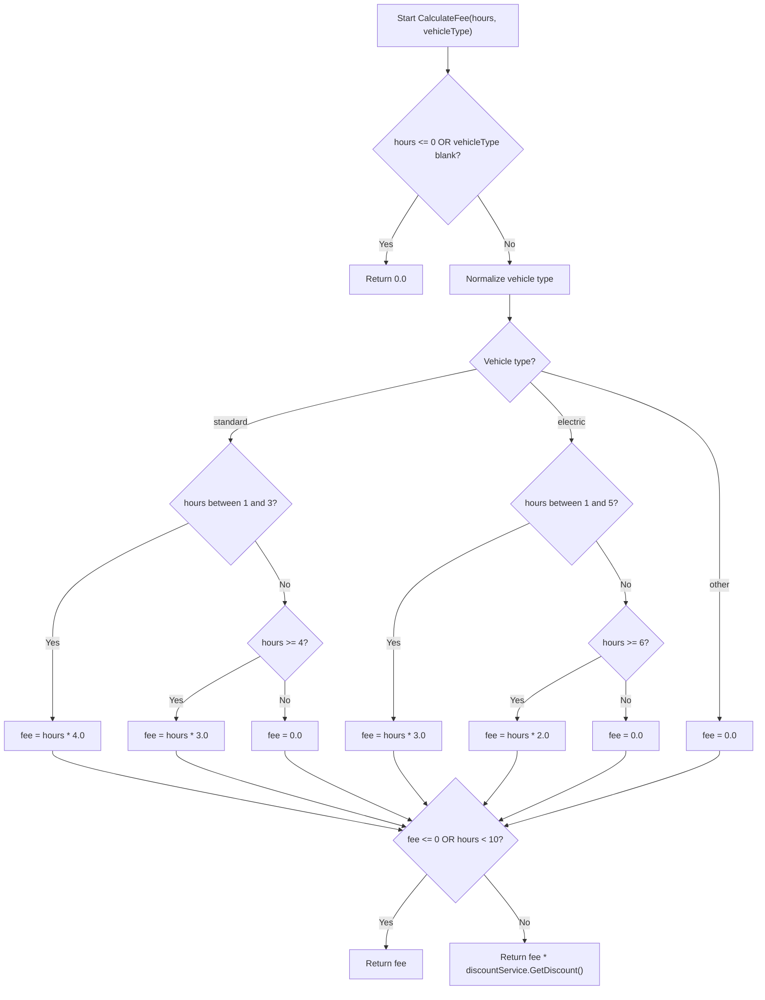

# Control Flow Graph And White-Box Analysis

System under test: `ParkingFeeCalculator.ParkingService.CalculateFee(int hours, string vehicleType)`.

## Refactored Method Summary

The refactored method validates hours and vehicle type, normalizes the vehicle type, selects the correct pricing rule, and applies the injected discount service only when the fee is positive and the vehicle is parked for 10 or more hours.

## Control Flow Graph

## Independent Paths

Using McCabe-style manual analysis, the key independent paths are:

| Path | Scenario | Expected result |
| --- | --- | --- |
| 1 | Invalid hours | Returns 0.0 |
| 2 | Blank vehicle type | Returns 0.0 |
| 3 | Standard, 1-3 hours | Uses EUR4 per hour |
| 4 | Standard, 4-9 hours | Uses EUR3 per hour without discount |
| 5 | Standard, 10+ hours | Uses EUR3 per hour and applies discount |
| 6 | Electric, 1-5 hours | Uses EUR3 per hour |
| 7 | Electric, 6-9 hours | Uses EUR2 per hour without discount |
| 8 | Electric, 10+ hours | Uses EUR2 per hour and applies discount |
| 9 | Unknown vehicle type | Returns 0.0 |

## Branch Coverage Test Mapping

| Branch / decision | Covered by test |
| --- | --- |
| `hours <= 0` true | `CalculateFee_ReturnsZero_ForInvalidHours` |
| `vehicleType` blank true | `CalculateFee_ReturnsZero_ForInvalidVehicleType` |
| Valid input path | Standard, electric, and discount test cases |
| Standard vehicle branch | `CalculateFee_ReturnsExpectedFee_ForStandardVehiclesUnderDiscountThreshold` |
| Electric vehicle branch | `CalculateFee_ReturnsExpectedFee_ForElectricVehiclesUnderDiscountThreshold` |
| Unknown vehicle branch | `CalculateFee_ReturnsZero_ForInvalidVehicleType("motorbike")` |
| Standard 1-3 hour branch | Standard test cases for 1 and 3 hours |
| Standard 4+ hour branch | Standard test cases for 4 and 9 hours, plus 10-hour discount test |
| Electric 1-5 hour branch | Electric test cases for 1 and 5 hours |
| Electric 6+ hour branch | Electric test cases for 6 and 9 hours, plus 10-hour discount test |
| Discount not applied | Under-threshold standard/electric tests check the normal fee before the discount starts |
| Discount applied | 10-hour standard/electric tests use a mocked discount value and check the discounted fee |
| Case-insensitive and trimmed input | `CalculateFee_IsCaseInsensitive_AndTrimsWhitespace` |
| Missing dependency guard | `Constructor_ThrowsArgumentNullException_WhenDiscountServiceIsMissing` |

## Notes On Intentional Defects In Provided Code

The original brief's supplied code contained defects and tight coupling:

- It created `DiscountService` directly inside `CalculateFee`, making it difficult to mock.
- It handled vehicle type case-sensitively, despite the brief requiring case-insensitive input.
- The standard vehicle condition used `hours < 3`, which excluded exactly 3 hours from the EUR4-per-hour rule.
- It calculated the discount even when no discount was needed.

The refactored solution corrects these issues and makes discount behavior testable through dependency injection.
